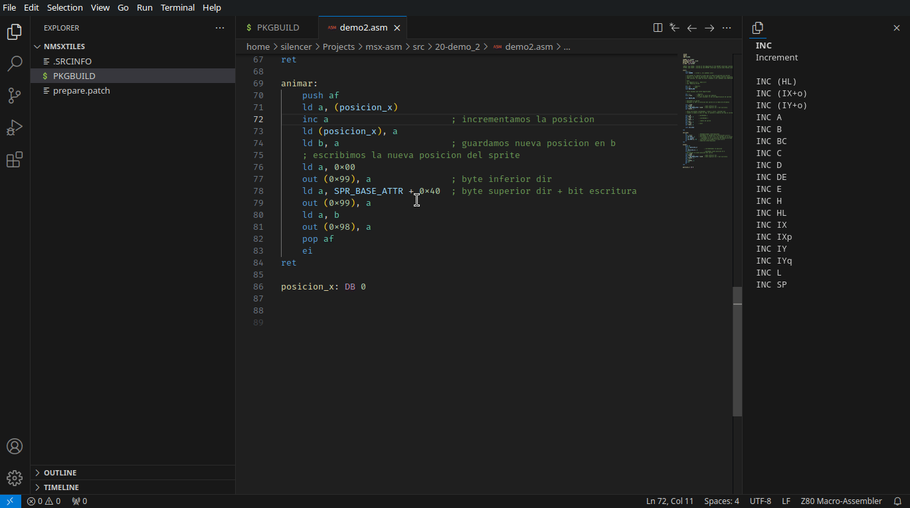
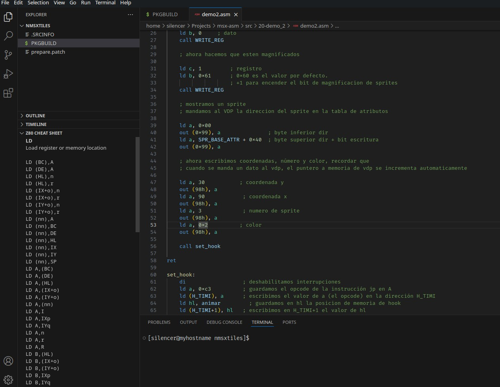
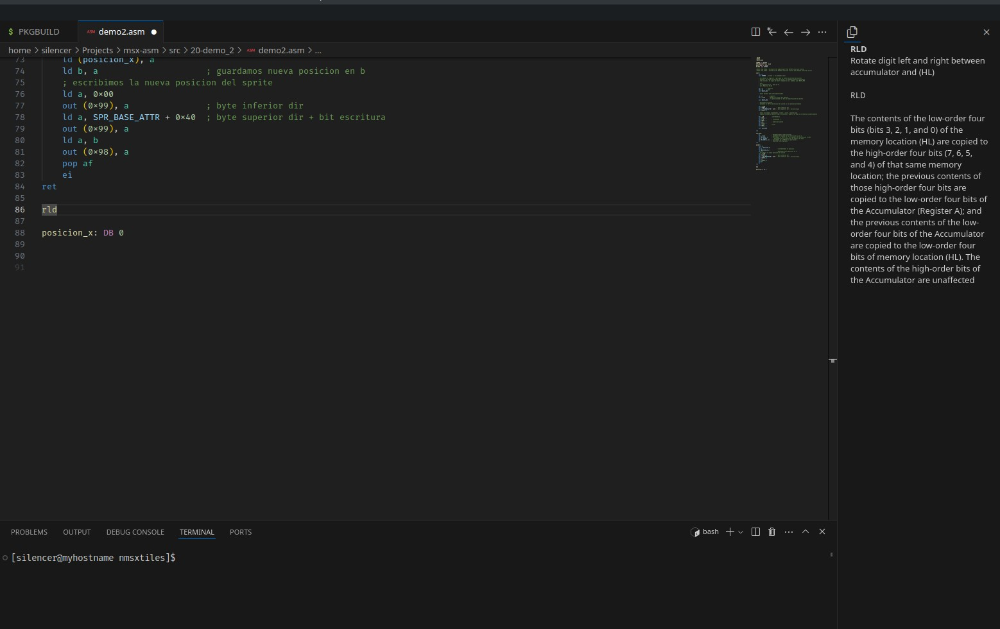

# README

Z80 Cheat Sheet extension provides a list of Z80 instructions that is visible in the explorer.

## Features

When the cursor is in a line that contains a Z80 instruction, the OP code variations get shown.

### 1.0.0

Initial release of Z80 Cheat Sheet extension.
